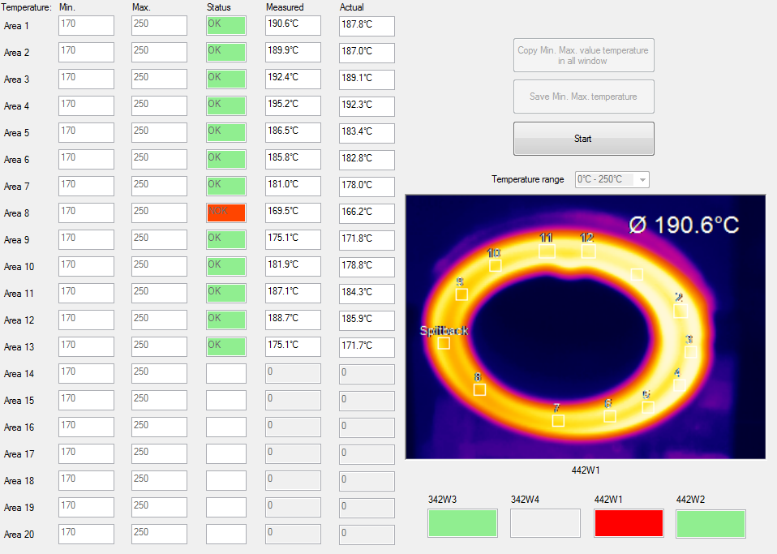
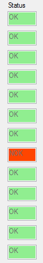
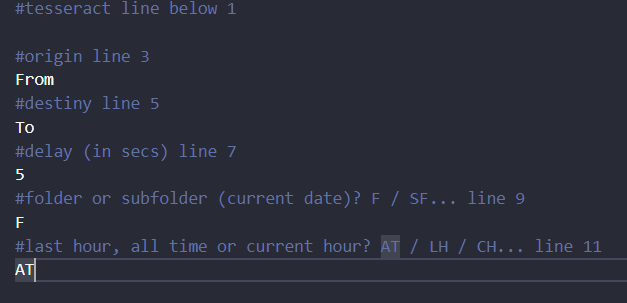
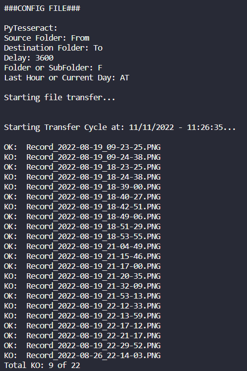
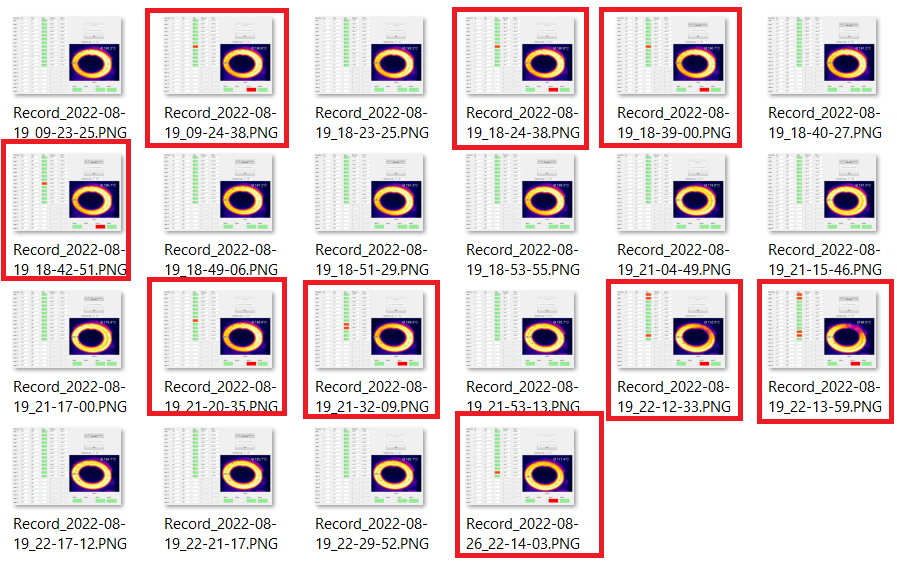
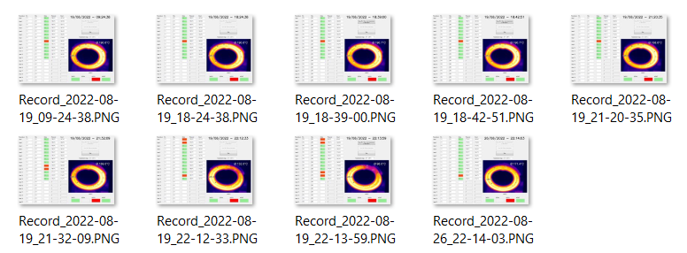

# CLASSIFY INDUSTRIAL THERMOCAMERAS IMAGES
## THE PROBLEM
 In industrial process, is common to use cameras to provide a vision system for machines and robots.
 The vision system can be used for a variety of purposes, including check position or temperature of something.
 In this particular case, the system vision is used to check temperature of welding. For each manufactured part, an image is taken. The problem is that the vision program (which has closed source code) don't separate which image is for a good piece or bad piece. Analyzing the image for each bad part manufactured is essential for adjustments and corrections in the production process. This job must be done by a algorithm since it creates more than 4000 pictures/day.

Below, is a standard picture taken from the process.
 As it is possible to see, this is a bad piece because we had a temperature (169.5°C) below the temperature range (170°C ~ 250°C).
 It shows a red square to identify.

   Standard Image

  

## HOW

 
  The idea to determine if the picture represents a bad or a good piece is just to check if there is a red square in 'Status' Column. Thus, the area of analisys is: 

  

 To achieve this, I'll use Tesseract, an open-source OCR (Optical Character Recognition).
In python, Tesseract can be used with pytesseract library. It requires to install the OCR and can be found at https://github.com/tesseract-ocr/tessdoc/blob/main/Downloads.md.  Another point is that, to determine when the event happened, the files is automatically named in the format 'Record_yyyy-MM-dd_hh-mm-ss', like: 'Record_2022-08-19_09-23-25'. This will be used to print on the copied images the occurrence of the event.

   The algorithm created needs some inputs, which can me made in 'config.cfg' file.

   'config.cfg'

  As it is shown, the config file needs 6 parameters:
 1 - Tesseract: Address to 'tesseract.exe' file;
 2 - Source Folder: folder which the algorithm will get the files;
 3 - Destiny Folder: Folder which the algorithm will copy files to;
 4 - Repeat Time: Second to the repeat the script;
 5 - Folder or Subfolder: Select if move all files from the folder choose in parameter 2 or take subfolder;
 6 - Period of Analisys: Select if copy files from last hour, current hour of all files in folder.

  
## THE RESULT
 As output of the algorithm is shown in the console:

   Console.

  

And the files (only from bad pieces) are moved from origin folder:

   Origin Folder.

  

to destiny folder:

   Destiny Folder.

  

## IMPROVEMENTS
 The algorithm appers to be very useful to analysts to take some action about the problems found. However, the script is not reachable to other people (like process operators, quality inspectors, manager and other). To increase the people that the script can be reached, we could create a method to delivery (automatically) the images to interested people. 
  As solution, An NodeJS/Node-Red script could be created to automatically send it through WhatsApp/E-mail/Telegram. I'm planning to create this script soon.