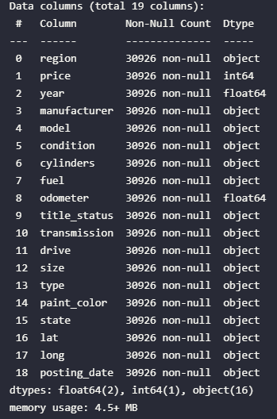
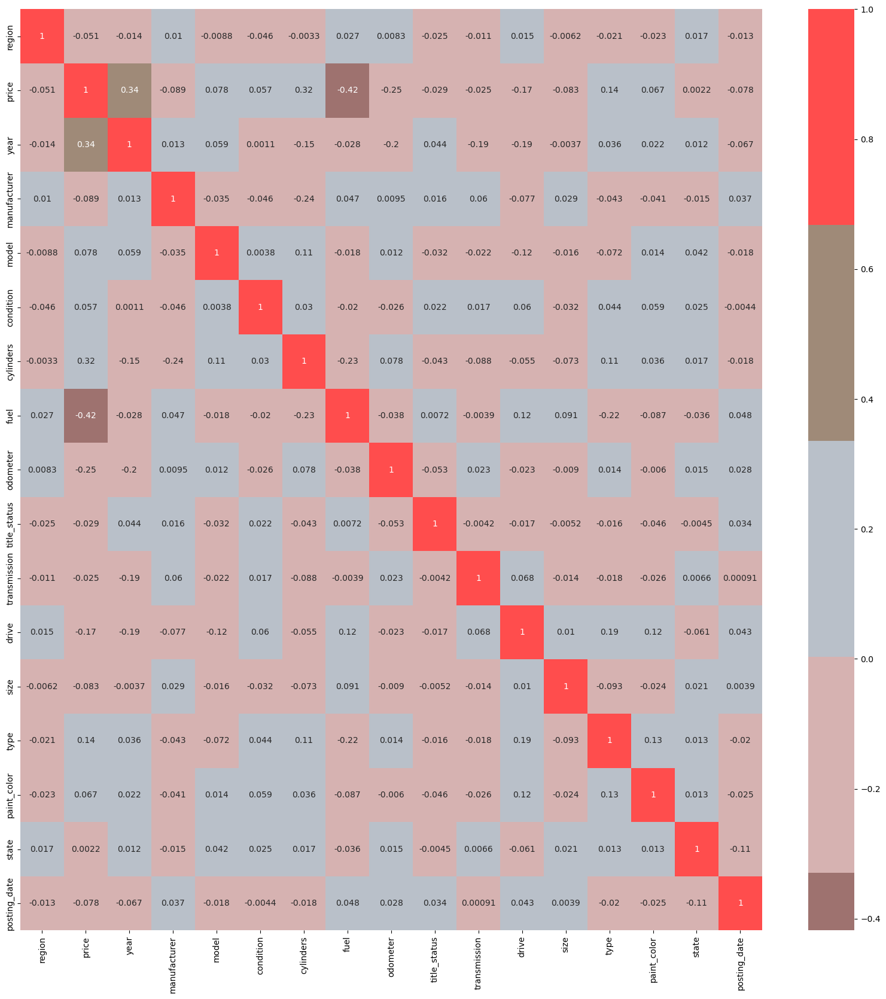
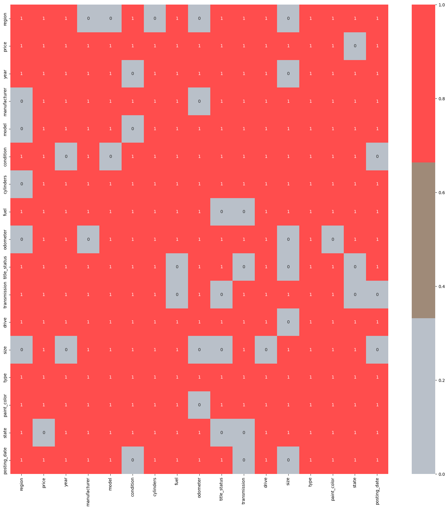
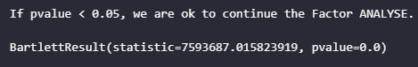
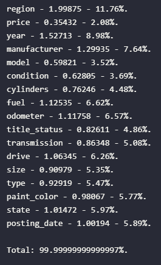
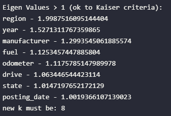
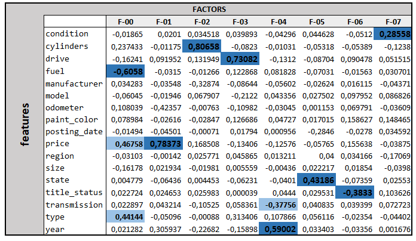

# FACTOR ANALYSIS 

## **UNDER CONSTRUCTION**

The objective here is apply **Factor Analysis**, explore it and learn profile of factors.

## THE DATA SET
This specific dataset shows a online marketplace of cars in USA. There are informations about the cars, price and location. All features names are easy to interpret.

## DATA PRE PROCESSING
First, the data info:

Data Info and Count of Income / Education Level.
  
As we can see, most part of the features are categorical and 3 continous. 

## SOME ANALYSE

   Correlation Heatmap.

  

   P-value for all correlations.

  

## STARTING FACTOR ANALYSIS

  

   Sphericity Bartlett Test.

  

  

   Eigen Values.

  

  

   Kaiser Criteria.

  

## FACTORS

**From distribution of clusters:**
   

   Factors.

  

**Insights**
 
-**Factor 00**: This factor indicates strongly and inversely associated to fuel and average  type and price of cars 
-**Factors 01, 02 and 03**: These factors are highly related, directly proporcional to price, cylinders of cars and drive, respectively.
-**Factor 04**: Related to year and transmission of cars.
-**Factor 05, 06 and 07**: Softly association. Factors 05 and 07 have directly correlation, whereas factor 06 is inversely correlation. Factor 05 means the state located, factor 06 condition of transmition. And last one, car's condition.

 