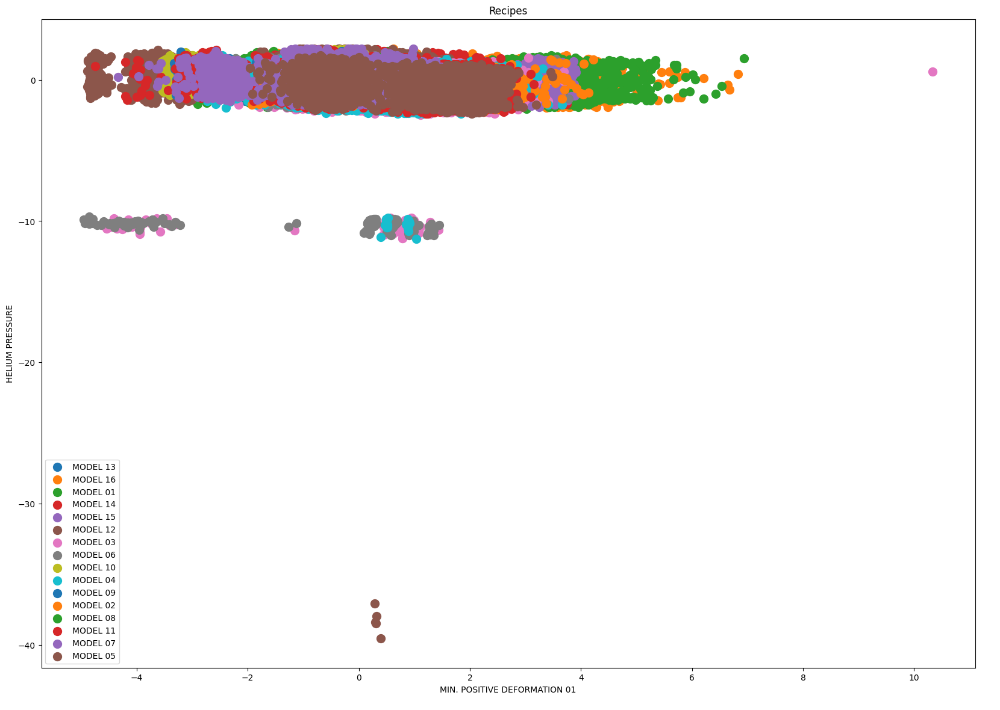
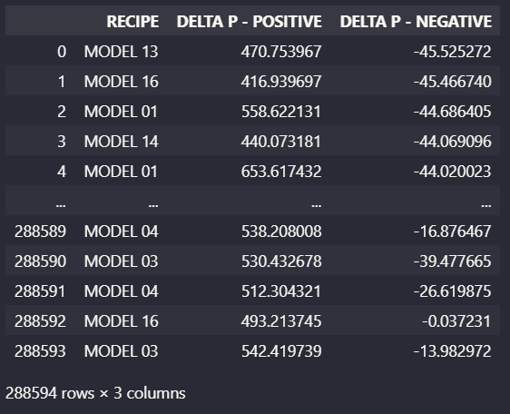
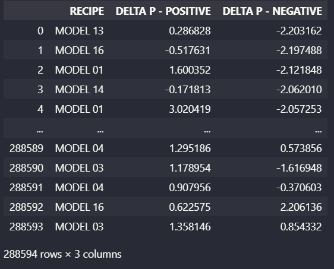
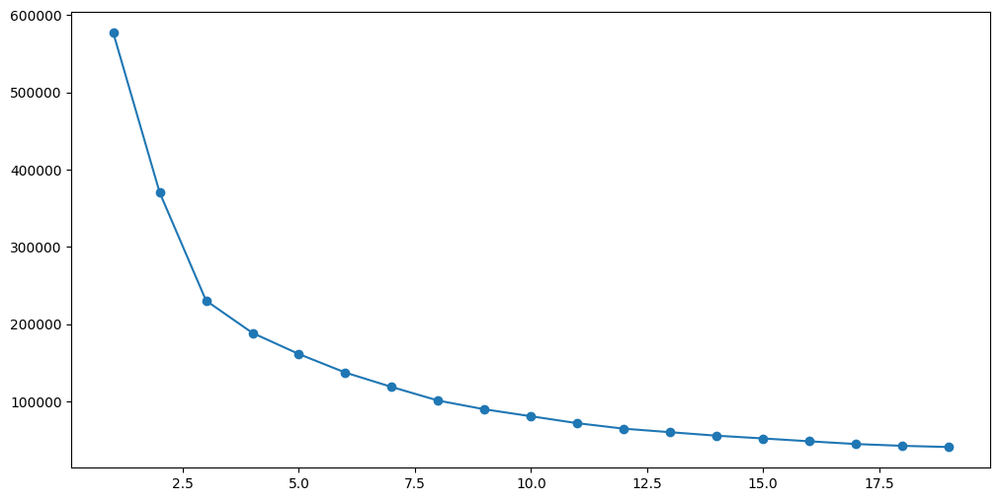
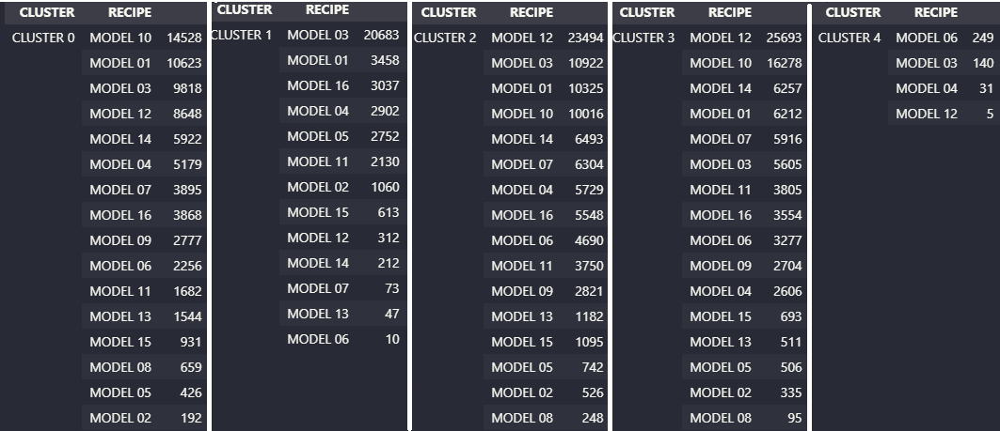

# CLUSTERING AUTOMOTIVE MANUFACTURING COMPONENTS

In the manufacturing process, we have the ability to work with different components.
However, despite being common, is not good for manufacturing process a large variety of its components.
The greater the similarity between the components manufactured, or the creation of groups (clusters), easier the manufacturing process will be.

Specific for this case, we have a lot of models (16 total) very similar to each other.
For each manufactured component, there are many measured parameters (21 total). 
The ideia here is to use some measured parameters to agroup by models (apply clusters) by using **K-MEANS/scikit-learn library.**
 K-Means is an unsupervised machine learning algorithm that create clusters to agroup data, based on give features. I won't go into detail about how the algorithm works due to the large amount of documentation available.
  
## DATA ANALISYS
As acquired knowledge of the machine, there are two special parameters that has variability according to the model produced (Positive Differential Pressure and Negative Differential Pressure).

  Positive/Negative Differential Pressure correlated with models.

  

In some cases, when there is a disparity in measurement units, apply the zscore is necessary. **This methodology aims to standardize different measurement units.** In this specific case, there is no need because both are pressure units (very similar). However, I chose to perform the zscore anyway, facilitating further analysis with other parameters that have different measurement units.

   
  
 On the left, the dataframe before zscore and on the right, after zscore. 

  
After apply zscore, we are able to apply Elbow Method which try to find the optimal K to apply in K-Means.
The Elbow Point is the optimal K, as shown below:

For our specific case, Elbow is the following:

   Optimal K = 5.

  
## APPLYING K-MEANS AND MODEL EVALUATION
Finally, applying K-Means, we get the 5 clusters:

As can be seen, the model created 5 well-defined clusters, which are consistent with the models of manufactured components..

  

## BUSINESS BENEFITS AND IMPROVEMENTS

Currently, the production line needs to produce in batches, without changing the model produced. With the implementation of a clustering system, there would be the possibility of creating a production mix, encompassing different models.
 

As possible improvement, we could find better efficiency in the model by using other parameters. 
However, it's necessary to be careful with the use of non-linear parameters, as is the case with most other parameters.
 

Another point of improvement is the application of the PCA (Principal Component Analysis) methodology to find groups of parameters that are similar to each other and combine with K-Means.Currently, the production line needs to produce in batches, without changing the model produced. With the implementation of a clustering system, there would be the possibility of creating a production mix, encompassing different models.
 

As possible improvement, we could find better efficiency in the model by using other parameters. 
However, it's necessary to be careful with the use of non-linear parameters, as is the case with most other parameters.
 

Another point of improvement is the application of the PCA (Principal Component Analysis) methodology to find groups of parameters that are similar to each other and combine with K-Means.