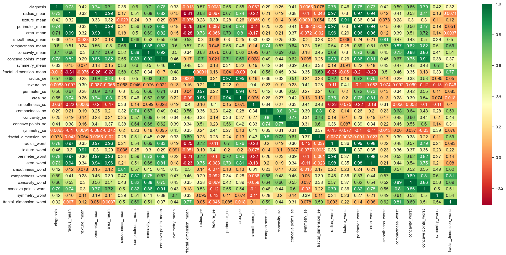

# KNN TO CANCER DATASET

This dataset has a total of 30 features related to cancers tumors (tumor radius, perimeters and others) and a single target (tumor benign/malignant). 
 The objective is to use **KNN algorithm** to classifying whether a person's tumor will be malignant or benign, based on features provided. 
 I will avoid further explanations of this algorithm, due to the large amount of documentation available. 

## DATA ANALISYS
Data table:

   We have 30 features and a single target (0/1).

Below, is the heatmap. Due to the large amount of features, the visualization is not so fast.

   Heatmap.

As KNN needs a K value to process the algorithm, I will run tests with different K values to find the best score.

   The optimal K is 13.

  
## MODEL EVALUATION AND IMPROVEMENTS

In the model has predicted 9 Benign Tumors but they are Malign Tumors (False Negative). This type of error is worrying since it is a cancer prediction.

 Confusion Matrix. 

  About the classification report, the accuracy seems good (0.96). Related to False Negative erros, the precision and recall to benign turmos got too low (0.93 for both).

 Classification Report

  As improvement, we could get a better heatmap by grouping some columns that are similar (maybe PCA method). 
 A second point, it would be interesting create a algorithm to determine which parameter is most likely to imply a malignant tumor.
 Another improvement point is to try KNN variations to reduce the Recall/False Negative problem.
