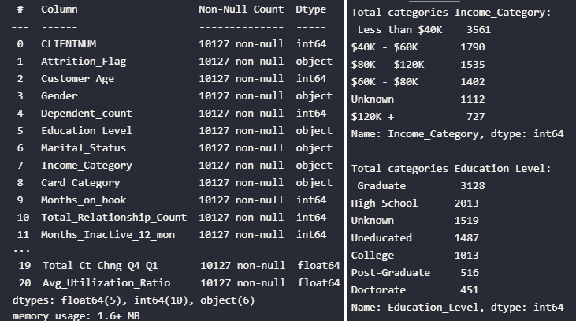
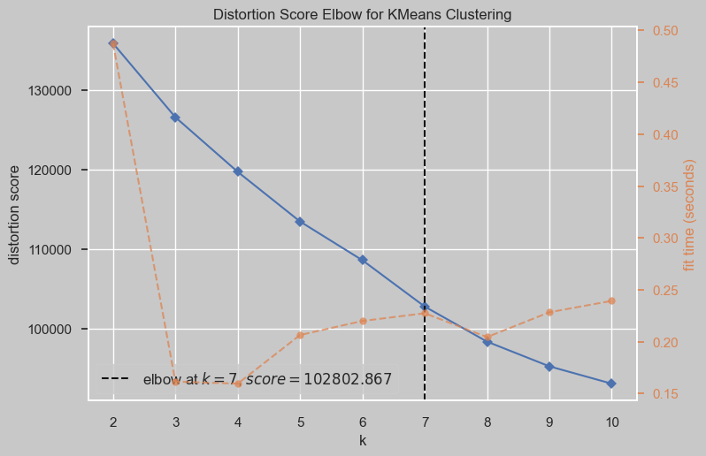
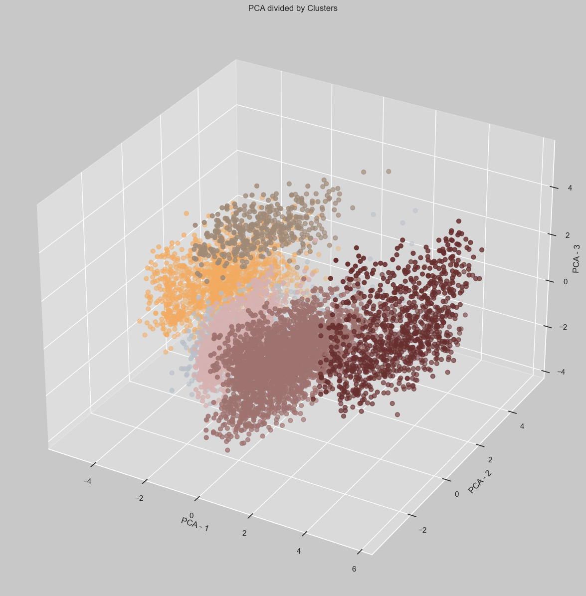
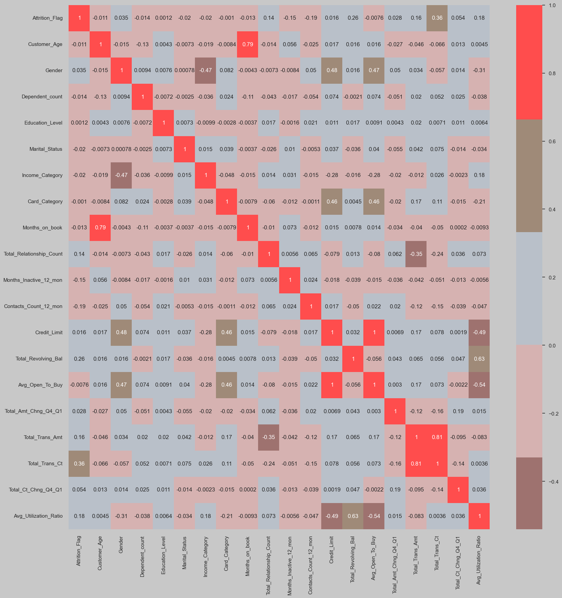
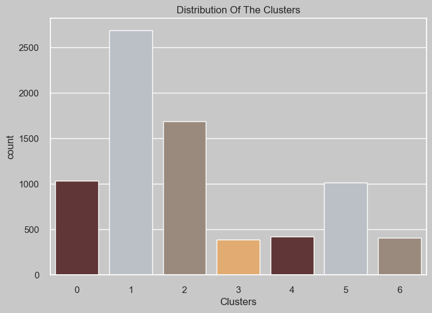
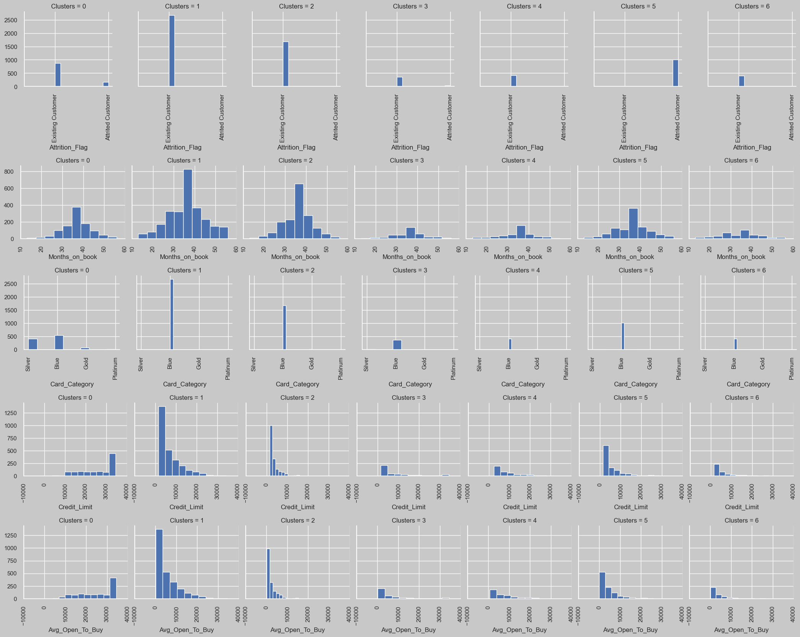

# CLUSTERING IN A BANK CHURN DATA

The objective here is apply **Agglomerative Clustering**, explore it and learn profile of clusters, apply **Principal Component Cnalysis (PCA)** to get reduce all features and check how it behaves. 

## THE DATA SET
This specific dataset shows a bank's churn in last 12 months. Churn is the information which customers stop doing business with a company over a given period of time. Although the columns are named and easily interpreted, some may raise questions:

**-Attrition_Flag** - Attrition Flag means account closed and Existing means not closed.
 **-Total_Relationship_Count** - Total no. of products held by the customer
 **-Months_Inactive_12_mon** - No. of months inactive in the last 12 months
 **-Contacts_Count_12_mon** - No. of Contacts in the last 12 months
 **-Total_Revolving_Bal** - Total Revolving Balance on the Credit Card
 **-Avg_Open_To_Buy** - Open to Buy Credit Line (Average of last 12 months)
 **-Total_Amt_Chng_Q4_Q1** - Change in Transaction Amount (Q4 over Q1)
 **-Total_Trans_Amt** - Total Transaction Amount (Last 12 months)
 **-Total_Trans_Ct** - Total Transaction Count (Last 12 months)
 **-Total_Ct_Chng_Q4_Q1** - Change in Transaction Count (Q4 over Q1)
 **-Avg_Utilization_Ratio** - Average Card Utilization Ratio

## DATA PRE PROCESSING
First, the data info:

Data Info and Count of Income / Education Level.
  
We have some 'object' columns that must be handled and some 'unknown' data. I'll remove unknown. Moreover, there are some outliers data that will be removed. After filter data, the features will be transformed to numeric and apply zscore (Standard Scaler).

## CLUSTERING
To know the best number of clusters, Elbow method:

   Elbow Method.

  

After apply **Agglomerative Clustering** with k=7, we can apply **PCA** with k=3 and take a look how clusters are divided.

   Clusters with PCA.

  

## ANALYSIS

  

   Heatmap with correlation between features.

  

  

   Distribution of Clusters.

  

  

   Some Clusters' features.

  

## NOTES

**From distribution of clusters:**
 I won't analyse every cluster, but the attention goes to **cluster 05.**
*It has **100% attrited customers.**
*Even making a lot of transactions/month, this cluster has low utilization ratio (only blue card).
*They have low income, low credit limit and low open to buy.

**From heatmap:**
 The lower of products held by the customer, the greater is the transaction amount (-0,35). 
Is possible to check that the amount of products held by the customer is not related to average utilization ratio (0,073).

 